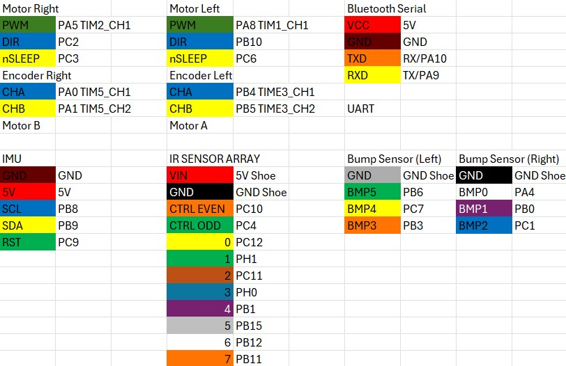

# ME 405 Term Project - Line Follower Robot

## Overview
This project involved the design and code implementation of a line-following robot based on the Romi chassis. The robot is capable of detecting and following a line and obstacles on a printed track using sensors and custom algorithms. The goal was to achieve reliable performance for the time-trial competition. 

# Included Files
- main.py
    - Defines tasks for motor control, IMU reading, line sensor processing, bump sensor detection, and other logic.
    - Serves as the main program file for the robot. 
- boot.py
    - Executes on boot and sets up the MicroPython board for board initialization
- pybcdc.inf
    - Contains Windows driver information for interfacing with the MicroPython board via USB
- cotask.py
    - Provides a cooperative multitasking framework using tasks created as generator functions
    - Includes a scheduler to manage task execution based task scheduling
- task_share.py
    - Implements classes for data sharing between tasks
    - Includes Queue and Share classes for managing shared data and inter-task communication
- BNO055_Driver.py
    - Implements a driver for the BNO055 IMU sensor.
    - Provides methods to configure the sensor, read and write calibration data, and retrieve orientation and angular velocity readings.
- Motor_Driver.py
    - Provides a driver to control DC motors using PWM
    - Gives the user the ability to set motor speed and direction
- Encoder_Driver.py
    - Implements a method to read quadrature encoder values such as position and velocity
- linesensor_driver.py
    - Provides methods to measure reflectivity using the IR emitters and sensors

## Features
- **Sensors**:
    - IR Line Sensor Array
    - BNO055 IMU
    - Two Motor Encoders
    - Switch Bump Sensors
- **Actuators**:
    - Two DC motors
- **Pololu Romi Chassis Kit**
    - Motor Driver and Power Distribution Board (Pololu item #: 3543)
    - Romi Encoder Pair
    - Romi Chassis (Pololu item #: 3500, 3501, 3502, 3504, 3506, or 3509)
- **Programming**:
    - Ran in a task-based structure using the scheduler
    - PID Control
    - Sensor Drivers
    - Line-following Control for curves, dotted lines, straight paths, and end detection
    - Prescribed Path-following 

## Mechanical Setup
In this project we installed switch bump sensors, line sensors, and an IMU onto the Romi chassis. The bump sensors came with screws that went into mounting holes that lined up with the Romi chassis so we installed it by screwing it into place. The line sensor array lined up with to larger cutouts that allowed the pins to extend above the chassis for wire connection. We zip-tied the pins to standoffs to secure these sensors into place. The IMU was connected to a breadboard and double sided tape to secure it above the bump sensors. 

## Driver Code Description
The main section of the code imports multiple drivers we wrote in order to function properly. The various drivers are listed in the previous "Included Files" section. Each driver, along with their functions and how they work, is described below.
### Motor_Driver.py
**init**  
The initialization for each motor takes 4 different inputs: PWM timer, PWM pin, direction pin, and enable pin. The PWM timer is a timer channel that is chosen for each motor. Each motor needs separate PWM timers and PWM pins, otherwise they would not be able to differentiate their speeds and direction. The directional and enable pins modify the direction and on/off settings for each motor. The PWM, direction, and enable pins are setup during initialization as push-pull output pins. The PWM timer channel gets setup as a PWM timer with 0 pulse width percent.  
**set_duty**  
The set duty function performs two tasks when called: set the PWM channel's pulse width percent with the input duty value and enable/disable the necessary direction pins. If the duty cycle is positive, the PWM channel is set to that value and the directional pin is set to low allow the motor to spin forward with the intended speed. If the duty cycle is negative, the PWM channel is set to absolute value of the duty cycle, and the directional is set to high to cause the motor to spin backwards with the intended duty cycle.  
**enable**  
When the enable function is called, it sets the enable pin to high to ensure the motor to turn off.  
**disable**  
When the disable function is called, it sets the enable pin to low to cause the motor to turn off.  
### Encoder_Driver.py
**init**  
The intialization for each encoder takes 3 different inputs: ENC timer, CH_A pin, and CH_B pin. The timer for each encoder must have two channels, which are what the channel A and channel B pins are for. CH_A and CH_B pins are configured such that they are two channels of the same timer and are also set to be used as encoder timers. Additionally, the initialization code resets all shared variables to zero, including prev_count, position, delta, and ticks.  
**update**  
The update function is the most important function of the encoder driver and is called before calling any other functions. Inside of this function, the total position and delta (change since last update) are updated by using the encoder timer channel. The function also detects overflows of the delta function in cases where the encoder rolls back past its initial position, and sets the delta to the according value without overflow. The update function also performs unit conversion to create true position and delta values using radians as the units, instead of encoder ticks.  
**get_position** 
When called, this function returns the true position (in radians), found in the update function.  
**get_delta** 
When called, this function returns the true delta (in radians), found in the update function.  
**zero** 
The zero function resets all variables, including counts, position, delta, velocities, and ticks back to zero. This function was only used for debugging purposes and is not called during the main code, because there is no scenarios where we would want to zero out the encoder during main code. 
**get_velocity** 
When called, this function returns the velocity (in rad/s) by using the delta and ticks (in us) since the last update. It is more accurate to use the ticks to find the velocity rather than a set period because the robot may not actually update on-time to the set-period, so the velocity must be calculated using real-time ticks. The function also returns the delta ticks to be used in the main code control loops. 
**calculate_robot_position** 
This is an unused function for when we were trying to track robot x and y position along with rotation values. We decided against using this code because the code would not account for wheel slip or any outside physical factors that it would not be able to detect. Instead, we use the BNO055 IMU to track angle for when it is necessary. We left the function inside the code in case we wanted to return to it at a later point.
### BNO055_Driver.py
**init** 
The initialization for the BNO055 IMU sets up the IMU as an I2C controller device. It then establishes all addresses needed to operate the IMU along with the reset pin as a push/pull output. 
**set_mode** 
The set_mode function takes one input, which should be written as a number the IMU can write to its operating address in order to set the mode. It sets the mode first to the config mode before setting the mode to the intended mode to properly set the IMU mode. The most common modes used are the config mode, to configure any settings, and the NDOF (9 degrees of freedom) mode, to allow for reading in any directional movement. 
**read_cal_byte** 
The read_cal_byte function reads the calibration bytes of the IMU. There are 3 calibration bytes: accelerometer, gyroscope, and magnet. Each byte ranges from 0-3, 3 indicating that it is fully calibrated. When configuring the IMU, the read calibration byte function was used to tell when the IMU was fully configured and ready for use. 
**read_cal_co** 
The read_cal_co function reads the calibration coefficients of the IMU. This function is to be called after the calibration bytes are all read to be 3. During testing, we used the read calibration coefficients to tell what the calibration coefficients for the IMU are once it is fully configured. We would then use these coefficients to reconfigure the IMU quickly for next trials, which is performed for the main code as well. 
**write_cal_co** 
The write_cal_co function writes the calibration coefficents to the IMU based off of the results from read calibration coefficient. The values inside of the function were determined during testing by calibrating the IMU. It then directly writes the values to the appropriate addresses in the IMU, removing the need to reconfigure the IMU every time we test the main code. 
**read_eula** 
The read_eula function reads and returns the euler angles from the IMU addresses. It returns the euler angles (in degrees) as a tuple. This function is utilized during the control loop to tell when the robot is facing key angles in some scenarios, proving very useful. 
**read_angv** 
The read_angv function reads and returns the angular velocities from the IMU addresses. It returns the angular velocities (in degrees/sec) as a tuple. This function is not utilized during the control loop because the control loop is based more on the encoder velocity values, but the angular velocities could be utilized instead if the control loop were implemented differently. 
**reset_IMU** 
The reset_IMU function sets the IMU reset pin to low, sleeps for half a second, then sets it to high, before sleeping for another half second. The sleeps ensure the IMU resets properly. This function is used just after initialization of the IMU to make sure it is reset properly without any leftover values being stored inside of it.  
### linesensor_driver.py
**init** 
The initialization for the line sensors sets up all necessary pins for the line sensor. These pins were determined through testing and are documented later in this document. All pins are setup as output pins in order to read each line sensor. There are 8 line sensor pins, and 2 additional control pins. 
**measure_reflectivity** 
The measure reflecitivity function takes one input: the sensor pin. The function first turns on all emitters by disabling the control pins. It then sets the chosen sensor pin to high and waits for 10 us. It then sets the pin up as an input and then sets the start time using microsecond ticks. It then waits for the voltage to decay and waits for the pin to go low, and measure that decay time. Before exiting the function, the control pins are set back to high to turn off the emitters once again. The function returns the decay time, which can be used to indicate if that specific sensor senses a line or not. 
### cotask.py and task_share.py
These drivers were provided to us in order to enable task-based coding. These drivers perform each task simultaneously and allow for tasks to share variable information with one another. Without the co-task and task share drivers, the main section of the code would have to be formatted much differently and be unable to perform parallel processing and simplified asynchronous operations.

## Main Code Description
The main code sets up multiple tasks in order to function, all of which utilize the previously described drivers. Each task and its purpose will be described in this section. Most tasks are run on the same period of 10 ms, which results in a frequency of 100 Hz.
### mot_enc_task_A
This task controls the motor and encoder for A, which is the left side. It first initiates the task, enabling the motor. It starts by setting the duty cycle to the shared duty cycle variable, which gets changed throughout the control loop task. It then updates the encoder and puts the position, delta, velocity, and ticks difference into shared variables to be referenced by the control loop and communications task.
### mot_enc_task_B
This task performs the same functions as the previous task, but instead for the motor encoder pair B, which is on the right side of the Romi. It puts all information into separate shared variables as well.
### read_imu_task
The read IMU task does exactly what its name describes. It prompts the IMU to read both its euler angles and angular velocities. However, our code only utilizes the euler x angle, also known as the heading. Therefore, this task pulls the euler x angle from the returned tuple and puts it into a shared variable. If we utilized other information from the IMU, it would be the same process to pull the value from the tuples and put them into shared variables.
### read_ls_task
Conversely, the read line sensor task has more functions than one might initially expect. It first initalizes a path_end variable, which is used to let the Romi know when it has finished the course. It then gets information from all 8 line sensors and a bump sensor detection variable. It uses the raw information from the line sensors to set a boolean-style variable of 0 or 1, depending on the raw line sensor decay time. If the decay time is longer than 1000 us, then a line has been detected on that sensor and it sets the respective variable to 1. It then uses the boolean-style variables in a centroid equation to determine a distance value. The resulting distance value tracks whether the Romi needs to adjust itself to stay on the line or not. The task also has special case code that begins running after the bump sensor gets triggered. It begins looking for instances where all 8 line sensors see a line, which would indicate that the Romi has past the finish line. If this does occur, it puts a 1 into an end detection variable, which triggers a special ending movement sequence.
### bump_task
The bump task looks for bump detection. Even though there are 6 different bump sensors, we need to detect if any of them get triggered indiscriminately. Bump pins are stored as an array as pulled-up input pins, and the task defines a function to put a value into a shared bump variable indicate "bumped" status. Ihe task runs a for loop that checks if any of the bump sensors get triggered by detecting an interrupt request falling signal.
### control_task
The control task is the largest and arguably most important task. It uses variables and values from all the previous tasks from the motor-encoder pairs, IMU, line sensors, and bump sensors. It first initiates a buffer and tracker variable, which are utilized later in the control loop. It gets shared variables from many previous variables: euler_x, bump, measured velocities, ticks differences, error values, line sensor distance, and end detection. It then first runs line following code. Line following code uses a PID control loop, described later in document, along with correctional code. The correctional code depends on the sign of the line sensor distance value. If the distance value is negative, then the robot is too far to the left, and the correctional code will decrease the speed of the right wheel to account for that. If the distance value is positive, then the robot is too far to the right, and the correctional code will decrease the speed of the left wheel to account for that. The correctional code is the distance value multiplied by a coefficient, which was determined through testing.  
The line follower code runs until the Romi detects an obstacle using the bump sensors. If the bump triggers, that means the Romi has detected the obstacle. The code then runs a pre-determined sequence to get around the obstacle. It backs up, turns about 45 degrees to the right, goes forward, turns 45 degrees to the left to face forward again, goes forward again, curves back towards the track until a line is detected, then finally turn back forward again. This sequence is determined using the buffer and tracker variables that were intialized at the beginning of the task, and it also utilizees PID control for better consistency. After the sequence completes, the Romi returns to the line following code. However, it begins looking for the finish line using the line sensor task, which is when all line sensors read black. If this occurs, the ending sequence begins. 
The ending sequence works similarly to the obstacle sequence, using the buffer and tracker variables. It first goes forward slightly, to fully enter the finish box. Then, it uses a special control loop using the euler x angle to fully turn around back towards start and its initial IMU euler x angle. It then stops briefly to ensure it is not moving. The Romi then drives forward back towards start using another special PID control loop using the euler x angle as a correctional value to try and stay as straight as possible. Once a line is detected again, that indicates the robot has once again reached the start box, and it drives forward briefly fully enter the start box.
### comms_task
The communications task is mostly used for testing and debugging. It prints values to the PUTTY console, which can be viewed if the robot is connected a computer. The task was modified depending on what we are testing, deleting or adding code to accomodate that. It functions by putting the shared variables into respective queues. It then prints the values from the queue in f strings. This task also uses a different period, because there is no way a human could process information being printed at 100 Hz. It instead uses a period of 1 second, resulting in one print per second, being much easier to read.
### Non-Task Main Code
The code outside of tasks is responsible for setting up multiple variables, pins, and actually executing the task structure using task_share and cotask. It sets up certain global variables, such as periods and gain values. The code then sets up pins and timers for all motors, encoders, and bump sensors. It then intializes the line sensors and the IMU. Next, all shared variables and queues are created. Almost all variables are floats rather than integers because we wanted to be able to use decimals or very precise values if necessary. Lastly, it sets up all tasks using cotask and appends them into a list to be run.

## Motor PID Control
The motor used a PID control algorithm to maintain a set speed. We began our controls design process by implementing the PID loop below. We derived the $K_P$ constant by using known information of the motor from the Pololu website and found $K_{ff}$, $K_D$ and $K_I$ through iteration. 

$$
K_V = \frac{150RPM*\frac{2Πradians-minutes}{60seconds-revolutions}}{4.5V}
$$
$$
V_{battery} = 6*1.45V
$$
$$
\omega_{shaft} = K_V*V_{battery}
$$
$$
\omega_{wheel} = \frac{\omega_{shaft}}{120}
$$
$$
K_P = \frac{100}{\omega_{shaft}}
$$
$$
K_P = 3.293 [\frac{\%}{rad/s}]
$$

# Motor A Step Response
$K_{ff}=3.1, K_P=3.92, K_d = 0.00001, K_i = 10$

Our initial value for $K_{ff}$ resulted in a steady state error of around $0.79\frac{rad}{s}$ indicating that it is too low. Increasing the feed forward constant would increase the duty cycle sent to the motor and reduce steady state error. 

$K_{ff}=4.5, K_P=3.92, K_d=0.00001, K_i=10$

We increased $K_{ff}$ and found that there was negligible steady state error in our step response. The motor speed remained steady with minor oscillations around the set-point. 

$K_{ff}=4.5, K_P=20, K_d=0.00001, K_i=10$

Through iterating on $K_P$ we noticed that the motor oscillated and produced an underdamped response. 

$K_{ff}=4.5, K_P=3.92, K_d=0.001, K_i=10$

Iterating on the derivative constant $K_d$ lead to a similar underdamped response.

# Motor B Step Response

$K_{ff}=3.3, K_P=3.92, K_d=0.00001, K_i=10$

Our initial feed forward constant $K_{ff}$ produced a steady state error of $2\frac{rad}{s}$. In order to reduce the steady state error, we can increase the feed forward constant so that motor B experiences a higher duty cycle. 

$K_{ff}=4.6, K_P=3.92, K_d=0.00001, K_i=10$

Increasing $K_{ff}$ resulted in negligible steady state error and a steady motor speed. The feed forward constant was different than motor A which can be attributed to differences between the motor constants of the two motors. 

$K_{ff}=4.6, K_P=20, K_d=0.00001, K_i=10$

We increased $K_P$ and observed an underdamped step response where the motor speed oscillated around $13.5\frac{rad}{s}$.

$K_{ff}=4.6, K_P=3.92, K_d=0.001, K_i=10$

Through testing different PID and $K_{ff}$ constants, we found that these constants produced the least steady state error:
$$
Motor A: $K_{ff}=4.5, K_P=3.92, K_d=0.00001, K_i=10$
$$
$$
Motor B: $K_{ff}=4.6, K_P=3.92, K_d=0.00001, K_i=10$
$$

## Pinout 

				

